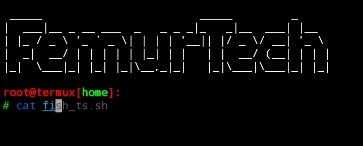

# T-Styling *based on fish*

### This script will make your termux work productive and look better. Enjoy! ! 

#### Installing

1. chmod +x \*.\*
2. bash fish_ts.sh or ./fish_ts.sh to install styling. 

#### Features
##### Custom Commands
+ Auto Complete everything **[ usage shell \* = sh \*.sh OR bash \*.bash ]**
+ Shows your name on the top with *figlet*
+ Colorfull

+ **Screenshot** 
https://is.gd/tstylingss

#### Uninstalling
1. Run the script again to uninstall styling.

*Special Thanks to **xenoCoder01**
for testing, modifying and helping to make this script work*
